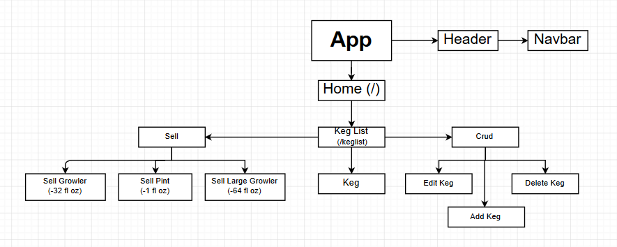

# Tap Room

##### React Week 1 & 2 Friday Independent Project By Kenneth Du; Epicodus - November 16, 2018 & November 30, 2018

## *Description*
A Tap Room recreated through React to demonstrate skills learned through Week 1 & Week 2 React

    As a patron, I want to see a list/menu of all available kegs. For each keg, I need to see its name, brand, price and alcoholContent (or perhaps something like flavor for a kombucha store).
    As an employee, I want to fill out a form when I tap a new keg to add it to the list. (Don't worry about authenticating employee user accounts yet.)
    As an employee, I want the option to edit a keg's properties after entering them just in case I make a mistake.
    As a patron and/or employee, I want to see how many pints are left in a keg. (Hint: A full keg has roughly 124 pints).
    As an employee, I want to be able to click a button next to a keg whenever I sell a pint of it. This should decrease the number of pints left by 1.
    As an employee, I want to be able to see kegs with less than 10 pints left so I can be ready to change them.
    As a patron, I want to have kegs prices to be color-coded for easy readability. Perhaps based on their price (greater or less than $5 per pint, perhaps) or the particular style of beer or kombucha.
    As a patron, I want to use the alcohol content property to display stronger beers differently than weaker beers.
    As an employee, I want to be able to click a button next to a keg whenever I sell a growler of it. Many growlers are 32 ounces, so this should decrease the number of pints left by 2.
    As an employee, I want to be able to click a button next to a keg whenever I sell a large growler. While most growlers are 32 ounces, some are 64. I'll need to select the appropriate growler size and correctly decrease the remaining number of pints left.

## Week 1 Objectives

    Development environment is fully-functional, including Babel transpiling, Webpack module bundling, a development server with hot module replacement, and linting.
    Components are used to create modular UI elements.
    propTypes define data types and shapes for all component props.
    Application successfully uses client-side routing via the React-Router library to create appearance of multiple pages.
    Styles are successfully added using CSS objects.
    Project was submitted by the Friday deadline.
    Project demonstrates an understanding of this week's concepts. If prompted, you can discuss your code with an instructor using the correct terminology.

## Week 2 Objectives

    Previous objectives are met (see below).
    Stateful components are used only when necessary.
    Commit history depicts that stateless functional components are created first, before refactoring to stateful class-based components.
    All data flow is unidirectional.
    State is lifted in an efficient manner that follows best practices.
    Methods are bound in component constructors when necessary, and only when necessary.
    Application is in a polished, portfolio-quality state.
    Project was submitted by the Friday deadline.
    Project demonstrates an understanding of this week's concepts. If prompted, you can discuss your code with an instructor using the correct terminology.

## *Known Bugs & Issues*
No known issues

## *Support and contact details*
Contact:

* Kenneth, kennethdu3@gmail.com

## *Technologies Used*
* React
* JavaScript
* CSS
* HTML
* Bootstrap

#### *Copyright* (c) 2018 Kenneth D., Epicodus
